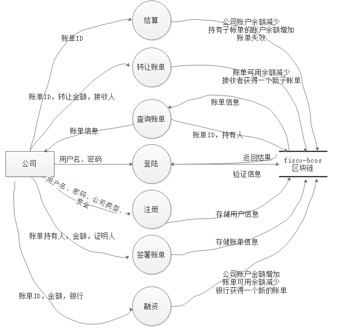

## **<center>中山大学数据科学与计算机学院本科生实验报告</center>**
### **<center>(2019年秋季学期)</center>**

| 课程名称 | 区块链原理与技术 |   任课老师   | 郑子彬 |
| :------: | :------------------: | :----------: | :----: |
|   年级   |    17级                  | 专业（方向） |   软件工程     |
|   学号   |    17308195                  |     姓名     | 颜屹豪       |
|   电话   |   15773541150                   |    Email     | 1418018431       |
| 开始日期 |       2019-10-17               |   完成日期   |   2019-12-13     |

## 一、项目背景
* 传统供应链金融  
  某车企（宝马）因为其造车技术特别牛，消费者口碑好，所以其在同行业中占据绝对优势地位。因此，在金融机构（银行）对该车企的信用评级将很高，认为他有很大的风险承担的能力。在某次交易中，该车企从轮胎公司购买了一批轮胎，但由于资金暂时短缺向轮胎公司签订了1000 万的应收账款单据，承诺1 年后归还轮胎公司1000 万。这个过程可以拉上金融0机构例如银行来对这笔交易作见证，确认这笔交易的真实性。在接下里的几个月里，轮胎公司因为资金短缺需要融资，这个时候它可以凭借跟某车企签订的应收账款单据向金融结构借款，金融机构认可该车企（核心企业）的还款能力，因此愿意借款给轮胎公司。但是，这样的信任关系并不会往下游传递。在某个交易中，轮胎公司从轮毂公司购买了一批轮毂，但由于租金暂时短缺向轮胎公司签订了500 万的应收账款单据，承诺1 年后归还轮胎公司500万。当轮毂公司想利用这个应收账款单据向金融机构借款融资的时候，金融机构因为不认可轮胎公司的还款能力，需要对轮胎公司进行详细的信用分析以评估其还款能力同时验证应收账款单据的真实性，才能决定是否借款给轮毂公司。这个过程将增加很多经济成本，而这个问题主要是由于该车企的信用无法在整个供应链中传递以及交易信息不透明化所导致的。
* 区块链+供应链金融  
  将供应链上的每一笔交易和应收账款单据上链，同时引入第三方可信机构来确认这些信息的交易，例如银行，物流公司等，确保交易和单据的真实性。同时，支持应收账款的转让，息的交易，例如银行，物流公司等，确保交易和单据的真实性。同时，支持应收账款的转让，融资，清算等融资，清算等，让核心企业的信用可以传递到供应链的下游企业，减小中小企业的融资难度。，让核心企业的信用可以传递到供应链的下游企业，减小中小企业的融资难度。
## 二、方案设计
* 基本功能:  
    * 用户登陆
    * 用户注册
    * 签署账单
    * 所持账单查询
    * 待还账单查询
    * 转让账单
    * 融资
    * 账单结算

* 存储设计  
    基于fisco-bcos的智能合约将数据存储在区块链上，以合约本身存储为主，数据库存储为辅  
    * 用户信息存储  
        在智能合约中，使用Company结构体存储用户基本信息，包含: 
        * 用户名
        * 用户密码
        * 用户余额
        * 用户是否为银行
        * 用户目前是否可用
        ```go
        struct Company{
            string name;
            string password;
            uint balance;
            bool isBank;
            bool isUsed;
        }
        ```  
        智能合约通过账户地址索引用户信息   
        ```mapping (address => Company) public companys;```  
        后来考虑到账户地址比较复杂，记忆困难，所以放弃了将address作为账户的打算，而是将用户名作为账户，为了能够适配旧代码，使用数据库company表来存储用户名与账户的对应关系  
        ```tf.createTable("company", "name", "address");```  
    * 账单信息存储  
        账单信息被分为两部分存储  
        * 基本信息  
            账单的基本信息记录账单的欠债人、金额、证明人  
            账单的附加信息通过指针连接成链，因此基本信息当中存储链表的首和尾   
            账单通过债权人地址来索引附加信息  
            ```go
            struct Receipt{
                address obligor;
                uint total;
                address certifier;
                address firstBill;
                address lastBill;
                mapping (address => Bill) bills;
                bool isUsed;
            }
            ```
        * 附加信息  
            附加信息由债权人持有，包含债权人地址、所持金额、可用金额(转让和融资使用)  
            附加信息通过指针连接成链  
            ```go
            struct Bill{
                uint amount;
                uint canUse;
                address previousBill;
                address nextBill;
                bool isUsed;
            }
            ```  
        * 映射  
            为了能够快速找到用户所持账单和待还账单，使用两个数据库表来存储关系  
            ```go
            tf.createTable("bill", "name", "receiptId");
            tf.createTable("receipt", "name", "receiptId");
            ```  
* 数据流图  
      
* 核心功能介绍  
    * 项目构成  
        ```
                .
        ├── chainclient
        │   ├── build
        │   ├── config
        │   ├── index.html
        │   ├── node_modules
        │   ├── package.json
        │   ├── package-lock.json
        │   ├── README.md
        │   ├── src
        │   ├── static
        │   └── test
        ├── chainserver
        │   ├── chainserver.iml
        │   ├── HELP.md
        │   ├── mvnw
        │   ├── mvnw.cmd
        │   ├── pom.xml
        │   ├── solcJ-all-0.4.25.jar
        │   ├── src
        │   └── target
        ├── contract
        │   ├── ChainServer_v2.sol
        │   └── Table.sol
        └── m

        11 directories, 13 files
        ```  
        项目分为链端(fisco-bcos与智能合约)，后端(chainserver)，前端(chainclient)  
        * 链端  
            链端是fisco-bcos区块链以及部署在链上的智能合约  
            智能合约被编译成java文件以便后端调用  
        * 后端  
            后端使用Spring Boot框架，实现RESTful样式的API  
            ```
            .
            ├── ChainApplication.java
            ├── client
            │   └── ChainClient.java
            ├── contract
            │   └── ChainServer_v2.java
            └── server
                ├── Config.java
                ├── ReceiptServer.java
                └── UserServer.java

            3 directories, 6 files

            ```  
            contract中存放被编译好的智能合约代码  
            client中存放与链端交互(调用合约)的代码，参考了fisco-bcos文档提供的Asset项目代码编写而成  
              
            启动方法:  
            * 首先需要将区块链节点证书拷贝到src/main/resources目录下  
                ```
                resources/
                ├── applicationContext.xml
                ├── application.properties
                ├── ca.crt
                ├── contract
                │   ├── ChainServer_v2.sol
                │   └── Table.sol
                ├── contract.properties
                ├── log4j.properties
                ├── node.crt
                ├── node.key
                ├── sdk.crt
                ├── sdk.key
                ├── static
                └── templates

                ```
            * 后端使用的是IDEA生成的Spring Boot项目，因此可以直接使用IDEA运行  
            * 使用maven管理依赖，因此也可以用```mvn spring-boot:run```启动项目  
            * solcJ-all包可能下载不下来，则需要将包导入maven本地仓库```mvn install:install-file -Dfile=./solcJ-all-0.4.25.jar -DgroupId=org.ethereum -DartifactId=solcJ-all -Dversion=0.4.25 -Dpackaging=jar```   
        * 前端  
            前端使用Vue.js框架+ElementUI，主要是因为最近参加另外一个项目，因此比较熟悉Vue.js框架+ElementUI  
            启动方法:  
            * 项目使用IDEA编写完成，因此可使用IDEA启动  
            * 命令行可进入项目后输入```npm install```，再输入```npm run dev```启动  
    * 功能介绍与实现  
        * 注册  
            * 链端  
                ```go
                function register(address company, string name, string password, uint balance, bool isBank) public returns(bool){
                    if (companys[company].isUsed)
                        return false;
                    uint cnt;
                    address[] memory entries;
                    (cnt, entries) = selectName(name);
                    if (cnt != 0)
                        return false;
                    insertName(name, company);
                    companys[company].name = name;
                    companys[company].balance = balance;
                    companys[company].isBank = isBank;
                    companys[company].password = password;
                    companys[company].isUsed = true;
                    return true;
                }
                ```  
                在链端对数据进行存储  
                * 首先判断该账户地址以及用户名是否已被注册过，保证唯一对应  
                * 将用户名与账户地址的对应关系插入到数据库中
                * 将用户信息存储在合约里  
            * 后端   
                ```java
                //为用户创建一个私钥账户(暂未使用)
                Credentials credentials = GenCredential.create();
                String address = credentials.getAddress();
                String privateKey = credentials.getEcKeyPair().getPrivateKey().toString(16);
                String publicKey = credentials.getEcKeyPair().getPublicKey().toString(16);
                //调用合约函数
                TransactionReceipt receipt = asset.register(address, name, password, amount, isBank).send();
                TransactionDecoder decoder = TransactionDecoderFactory.buildTransactionDecoder(ChainServer_v2.ABI, "");
                InputAndOutputResult outputResult = decoder.decodeOutputReturnObject(receipt.getInput(), receipt.getOutput());
                List<ResultEntity> response = outputResult.getResult();
                ```  
                后端首先为注册的用户生成一个私钥账户(由于计划变动，账户暂时没有其他功能)  
                然后将用户输入的信息与生成的账户一起传入合约中，获得返回值  
                ```后端与链端的交互代码都与这相似(将数据传入合约，返回数据)，为了节省篇幅，因此后面不再进行解释```  
                对外提供一个POST接口，接收注册请求  
                ```java
                @RequestMapping(value = "/register", method = RequestMethod.POST)
                public Map<String, String> register(@RequestBody Map<String, String> user){
                    return ChainApplication.asset.register(user.get("username"), user.get("password"), new BigInteger(user.get("amount")), user.get("bank").equals("true"));
                }
                ```  
            * 前端  
                前端向后端发送POST请求进行注册，注册成功后进入主页  
                ```js
                // 向后端发生POST请求，注册
                var that = this
                this.$axios.request({
                    url: 'http://localhost:8080/user/register',
                    headers: {
                    'Content-Type': 'application/json;charset=UTF-8'
                    },
                    method: 'POST',
                    data: JSON.stringify({
                    username: this.userID,
                    password: this.password,
                    bank: this.radio,
                    amount: this.balance
                    }),
                    responseType: 'json'
                }).then(function (response) {
                    console.log(response.data)
                    if (response.data.status === 'ok') {
                    that.$store.commit('saveUser', {
                        username: that.userID,
                        password: response.data.password
                    })
                    that.$router.push('/')
                    } else {
                    alert('注册失败')
                    }
                })
                ```
        * 登陆
            * 链端  
                ```go
                function login(address company, string password) public returns(bool){
                    if (!companys[company].isUsed)
                        return false;
                    return (keccak256(companys[company].password)==keccak256(password));
                }
                ```  
                链端获取存储用户的密码，与传入的密码进行比对，返回结果  
            * 后端    
                对外提供POST接口，将数据传入合约中，并返回结果  
                ```java
                @RequestMapping(value = "/login", method = RequestMethod.POST)
                @ResponseBody
                public Map<String, String> login(@RequestBody Map<String, String> user){
                    return ChainApplication.asset.login(user.get("username"),user.get("password"));
                }
                ```  
            * 前端  
                向后端发送POST请求，登陆成功后记录用户信息并进入主页  
                ```js
                // 向后端发生POST请求，登录
                var that = this
                this.$axios.request({
                    headers: {
                    'Content-Type': 'application/json;charset=UTF-8'
                    },
                    url: 'http://localhost:8080/user/login',
                    method: 'POST',
                    data: JSON.stringify({
                    username: this.userID,
                    password: this.password
                    }),
                    responseType: 'json'
                }).then(function (response) {
                    console.log(response.data)
                    if (response.data.status === 'ok') {
                    that.$store.commit('saveUser', {
                        username: that.userID,
                        password: that.password
                    })
                    that.$router.push('/')
                    } else {
                    alert('登录失败')
                    }
                })
                ```  
        * 查询账单  
            * 链端
                查询账单可分为携带附加信息与不携带附加信息，在链端分成两部分实现(获取基本信息与获取附加信息)  
                ```go
                mapping (uint => Receipt) public receipts;
                function getBillAmount(uint rId, address creditor) public returns(uint, uint){
                    return (receipts[rId].bills[creditor].amount, receipts[rId].bills[creditor].canUse);
                }
                ```  
                receipts是rId到账单的映射，可直接返回基本信息  
                getBillAmount则返回附加信息   
            * 后端  
                后端提供GET接口，接收两种查询请求
                ```java
                @RequestMapping(value = "/{rId}/content", method = RequestMethod.GET)
                public Map<String, String> receiptContent(@PathVariable("rId") String rId){
                    return ChainApplication.asset.queryReceipt(new BigInteger(rId));
                }

                @RequestMapping(value = "/{rId}/bills/{username}", method = RequestMethod.GET)
                public Map<String, String> billContent(@PathVariable("rId") String rId, @PathVariable("username") String username){
                    return ChainApplication.asset.queryBill(new BigInteger(rId), username);
                }
                ```  
            * 前端  
                前端向后端发送GET请求，将获得的信息显示在网页上  
                ```js
                var that = this
                if (this.name === '') {
                    // 向后端发生GET请求，查询基本信息
                    this.$axios.request({
                    url: 'http://localhost:8080/receipt/' + this.rId + '/content',
                    method: 'GET'
                    }).then(function (response) {
                    console.log(response.data)
                    if (response.data.status === 'ok') {
                        that.tId = that.rId
                        that.obligor = response.data.obligor
                        that.used = response.data.used
                        that.total = response.data.total
                    } else {
                        alert('查询失败')
                    }
                    })
                } else {
                    // 向后端发生GET请求，查询详细信息
                    this.$axios.request({
                    url: 'http://localhost:8080/receipt/' + this.rId + '/bills/' + this.name,
                    method: 'GET'
                    }).then(function (response) {
                    console.log(response.data)
                    if (response.data.status === 'ok') {
                        that.tId = that.rId
                        that.obligor = response.data.obligor
                        that.used = response.data.used
                        that.total = response.data.total
                        that.creditor = response.data.creditor
                        that.amount = response.data.amount
                        that.canUse = response.data.canUse
                    } else {
                        alert('查询失败')
                    }
                    })
                }
                ```  
        * 签署账单  
            * 链端  
                链端接收输入后首先判断用户是否存在  
                然后将新的账单ID插入到数据库中欠债人与持有人的表中  
                最后将账单信息存储在合约中
                ```go
                function signRecipts(address obligor, address creditor, uint amount, address certifier) public returns(bool, uint){
                    if (!companys[obligor].isUsed || !companys[creditor].isUsed)
                        return (false, 0);
                    insertBill(companys[creditor].name, tId);
                    insertReceipt(companys[obligor].name, tId);
                    receipts[tId].obligor = obligor;
                    receipts[tId].total = amount;
                    receipts[tId].certifier = certifier;
                    receipts[tId].firstBill = receipts[tId].lastBill = creditor;
                    receipts[tId].isUsed = true;
                    receipts[tId].bills[creditor].canUse = receipts[tId].bills[creditor].amount = amount;
                    receipts[tId].bills[creditor].isUsed = true;
                    emit Sign(tId, obligor, creditor, amount, certifier);
                    tId++;
                    return (true, tId-1);
                }
                ```  
            * 后端  
                对外提供POST接口  
                ```java
                @RequestMapping(value = "/sign", method = RequestMethod.POST)
                public Map<String, String> signReceipt(@RequestBody Map<String, String> input){
                    return ChainApplication.asset.signReceipt(input.get("obligor"), input.get("password"),input.get("creditor"), new BigInteger(input.get("amount")),input.get("certifier"));
                }
                ```  
                由于没有时间做token认证，所以我对所有要更改数据的接口都要求输入账号密码来进行身份认证  
            * 前端  
                前端向后端发送POST请求来签署账单，要求必须登陆  
                ```js
                // 向后端发生POST请求，签署账单
                var that = this
                this.$axios.request({
                    headers: {
                    'Content-Type': 'application/json;charset=UTF-8'
                    },
                    url: 'http://localhost:8080/receipt/sign',
                    method: 'POST',
                    data: JSON.stringify({
                    obligor: username,
                    password: password,
                    creditor: this.form.name,
                    amount: this.form.amount,
                    certifier: this.form.certifier
                    }),
                    responseType: 'json'
                }).then(function (response) {
                    console.log(response.data)
                    // 传送数据到store.js的saveToken，并回到主页
                    if (response.data.status === 'ok') {
                    that.rId = response.data.rId
                    that.obligor = response.data.obligor
                    that.creditor = response.data.creditor
                    that.amount = response.data.amount
                    that.certifier = response.data.certifier
                    } else {
                    alert('账单签署失败')
                    }
                })
                ```  
        * 转让账单  
            * 链端  
                链端接收输入后，首先进行合法性检测  
                检测通过后，将发送者的账单余额与可用余额减少，接收者增加  
                如果接收者所持有的子帐单此前未被生成过，则将其设置为有效并插入到链表和数据库中
                ```go
                function transferPayment(uint rId, address sender, address receiver, uint amount) public returns(bool){
                    if (!companys[sender].isUsed || !companys[receiver].isUsed)
                        return false;
                    if (!receipts[rId].bills[sender].isUsed || receipts[rId].bills[sender].canUse < amount)
                        return false;
                    receipts[rId].bills[sender].amount -= amount;
                    receipts[rId].bills[sender].canUse -= amount;
                    receipts[rId].bills[receiver].amount += amount;
                    receipts[rId].bills[receiver].canUse += amount;
                    if (!receipts[rId].bills[receiver].isUsed){
                        insertBill(companys[receiver].name, rId);
                        
                        receipts[rId].bills[receiver].isUsed = true;
                        receipts[rId].bills[receiver].previousBill = receipts[rId].lastBill;
                        receipts[rId].bills[receipts[rId].lastBill].nextBill = receiver;
                        receipts[rId].lastBill = receiver;
                    }
                    emit Transfer(rId, sender, receiver, amount);
                    return true;
                }
                ```  
            * 后端  
                后端提供POST接口  
                ```java
                @RequestMapping(value = "/transfer", method = RequestMethod.POST)
                public Map<String, String> transferPayment(@RequestBody Map<String, String> input){
                    return ChainApplication.asset.transferPayment(new BigInteger(input.get("rId")),input.get("sender"),input.get("password"),input.get("receiver"),new BigInteger(input.get("amount")));
                }
                ```  
            * 前端   
                前端向后端发送POST请求进行账单转让，要求必须登陆  
                ```js
                // 想后端发生POST请求，进行账单转让
                var that = this
                this.$axios.request({
                    headers: {
                    'Content-Type': 'application/json;charset=UTF-8'
                    },
                    url: 'http://localhost:8080/receipt/transfer',
                    method: 'POST',
                    data: JSON.stringify({
                    sender: username,
                    password: password,
                    receiver: this.form.name,
                    amount: this.form.amount,
                    rId: this.form.rId
                    }),
                    responseType: 'json'
                }).then(function (response) {
                    console.log(response.data)
                    if (response.data.status === 'ok') {
                    that.rId = response.data.rId
                    that.from = response.data.from
                    that.to = response.data.to
                    that.amount = response.data.amount
                    } else {
                    alert('账单转让失败')
                    }
                })
                ```  
        * 融资  
            * 链端  
                融资事实上就是会改变账户余额的账单签署  
                用户输入所持有的账单进行融资  
                用户余额增加，所持账单可用余额减少(避免重复融资或转让)，银行获得一张新的关于用户的账单(不是输入的那张)  
                ```go
                function financing(uint rId, address bank, address creditor, uint amount) public returns(bool){
                    if ((!receipts[rId].bills[creditor].isUsed || receipts[rId].bills[creditor].canUse < amount)) return false;
                    if (!companys[bank].isBank || companys[bank].balance < amount)
                        return false;
                    companys[bank].balance -= amount;
                    companys[creditor].balance += amount;
                    receipts[rId].bills[creditor].canUse -= amount;
                    signRecipts(creditor, bank, amount, bank);
                    emit Finance(rId, creditor, amount);
                    return true;
                }
                ```  
            * 后端  
                后端提供POST接口  
                ```java
                @RequestMapping(value = "/finance", method = RequestMethod.POST)
                public Map<String, String> financing(@RequestBody Map<String, String> input){
                    return ChainApplication.asset.financing(new BigInteger(input.get("rId")), input.get("bank"),input.get("creditor"),input.get("password"),new BigInteger(input.get("amount")));
                }
                ```  
            * 前端  
                前端向后端发送POST请求进行融资，要求必须登陆  
                ```js
                // 向后端发生POST请求，结算
                var that = this
                this.$axios.request({
                    headers: {
                    'Content-Type': 'application/json;charset=UTF-8'
                    },
                    url: 'http://localhost:8080/receipt/finance',
                    method: 'POST',
                    data: JSON.stringify({
                    creditor: username,
                    password: password,
                    bank: this.form.name,
                    amount: this.form.amount,
                    rId: this.form.rId
                    }),
                    responseType: 'json'
                }).then(function (response) {
                    console.log(response.data)
                    if (response.data.status === 'ok') {
                    that.rId = response.data.rId
                    that.from = response.data.bank
                    that.to = response.data.creditor
                    that.amount = response.data.amount
                    } else {
                    alert('融资失败')
                    }
                })
                ```  
        * 结算  
            * 链端  
                链端接收输入后首先进行合法性检测  
                检测通过后将结算人的账户余额减少  
                通过子帐单连接成的链表依次结算每个账单持有者，将其余额增加，删除账单信息
                ```go
                function settle(uint rId, address obligor) public returns(bool){
                    if (!receipts[rId].isUsed || (receipts[rId].obligor == obligor) || (receipts[rId].total > companys[obligor].balance))
                        return false;
                        
                    companys[obligor].balance -= receipts[rId].total;
                    address creditor = receipts[rId].firstBill;
                    
                    while(creditor!=receipts[rId].lastBill){
                        removeBill(companys[creditor].name, rId);    
                        companys[creditor].balance += receipts[rId].bills[creditor].amount;
                        receipts[rId].bills[creditor].isUsed = false;
                        creditor = receipts[rId].bills[creditor].nextBill;
                    }
                    removeBill(companys[creditor].name, rId);  
                    companys[creditor].balance += receipts[rId].bills[creditor].amount;
                    receipts[rId].isUsed = false;
                    removeReceipt(companys[obligor].name, rId);
                    return true;
                }
                ```  
            * 后端  
                后端提供POST接口  
                ```java
                @RequestMapping(value = "/settle", method = RequestMethod.POST)
                public Map<String, String> settle(@RequestBody Map<String, String> input){
                    return ChainApplication.asset.settle(new BigInteger(input.get("rId")),input.get("obligor"),input.get("password"));
                }
                ```  
            * 前端  
                前端向后端发送POST请求进行结算，要求必须登陆  
                ```js  
                // 向后端发生POST请求，结算
                var that = this
                this.$axios.request({
                    headers: {
                    'Content-Type': 'application/json;charset=UTF-8'
                    },
                    url: 'http://localhost:8080/receipt/settle',
                    method: 'POST',
                    data: JSON.stringify({
                    obligor: username,
                    password: password,
                    rId: this.form.rId
                    }),
                    responseType: 'json'
                }).then(function (response) {
                    console.log(response.data)
                    if (response.data.status === 'ok') {
                    that.rId = response.data.rId
                    that.obligor = response.data.obligor
                    } else {
                    alert('账单结算失败')
                    }
                })
                ```

## 三、功能测试  
* 演示视频已在github当中，也可优酷在线播放  
    [https://v.youku.com/v_show/id_XNDQ2ODUyODM4MA==.html?spm=a2hzp.8244740.0.0](https://v.youku.com/v_show/id_XNDQ2ODUyODM4MA==.html?spm=a2hzp.8244740.0.0)  
* 对各功能进行测试，前端控制台接收返回值如下:  
      
    可用看到各功能正常工作

## 四、界面展示
* 注册  
      
* 登陆  
      
* 查询账单  
      
* 签署账单  
      
* 转让账单  
      
* 融资  
      
* 结算  
      
* 用户信息  
    
## 五、心得体会  
做完所有工作时，已经是DDL的最后一个晚上了，倒不是因为故意一直拖到现在，而是因为其他课业给了很大的压力。因为时间原因，很多事先计划的内容最后都没能实现，例如融资功能，最初我是计划完成一个申请+审批的系统，最后未能成行。目前这个项目还是由很大提升空间的。  
这个大作业应该是目前遇到的工作量最大的之一，因为链、后、前端都需要一个人写，而以往常常是组队完成。不仅仅是刚学区块链，后端SpringBoot框架和前端Vue.js也是最近才接触到，花费了很多时间去学习，幸好能够在网上找到很多资料，把所有雷都灭了。  
不过事实上，区块链这门课是目前收获最大的课程。首先是课堂内容充实而简单，易于理解，课后又有文献资料提供阅读；大作业虽难，但是完整的做下来可以确切的感受到自己能力提升；作业期间TA和微信群的咨询们都给了很多帮助，虽然我没有提问，但是同学们把我遇到的坑都提出来了(hh)。  
不管怎么样，区块链大作业就告一段落了，未来可能会继续完善项目(毕竟有些想法还没有完成)，不够目前先歇歇了。期待课程结束时自己能够获得一个满意的结果。  

## 六、加分项  
* 使用Vue.js+ElementUI完成前端，界面简洁而高效，提供身份认证等功能  
    ```
    .
    ├── App.vue
    ├── assets
    │   └── logo.png
    ├── components
    │   ├── Finance.vue
    │   ├── Index.vue
    │   ├── Login.vue
    │   ├── Query.vue
    │   ├── Register.vue
    │   ├── Settle.vue
    │   ├── Sign.vue
    │   ├── Transfer.vue
    │   └── UserContent.vue
    ├── main.js
    ├── router
    │   └── index.js
    └── store
        └── store.js

    ```  
* 后端实现RESTful风格的API，服务端与客户端、前端与后端分离，便于代码扩展与功能升级  
    ```java
    @RestController
    @RequestMapping("/user")
    public class UserServer {

        @RequestMapping(value = "/login", method = RequestMethod.POST)
        @ResponseBody
        public Map<String, String> login(@RequestBody Map<String, String> user){
            return ChainApplication.asset.login(user.get("username"),user.get("password"));
        }

        @RequestMapping(value = "/register", method = RequestMethod.POST)
        public Map<String, String> register(@RequestBody Map<String, String> user){
            return ChainApplication.asset.register(user.get("username"), user.get("password"), new BigInteger(user.get("amount")), user.get("bank").equals("true"));
        }

        @RequestMapping(value = "/{username}/content", method = RequestMethod.GET)
        public Map<String, String> userContent(@PathVariable("username") String username){
            return ChainApplication.asset.queryUserContent(username);
        }

        @RequestMapping(value = "/{username}/address", method = RequestMethod.GET)
        public Map<String, String> userAddress(@PathVariable("username") String username){
            return ChainApplication.asset.selectName(username);
        }

        @RequestMapping(value = "/{username}/bills", method = RequestMethod.GET)
        public Map<String, String> userBills(@PathVariable("username") String username){
            return ChainApplication.asset.selectBill(username);
        }

        @RequestMapping(value = "/{username}/receipts", method = RequestMethod.GET)
        public Map<String, String> userReceipts(@PathVariable("username") String username){
            return ChainApplication.asset.selectReceipt(username);
        }

    }
    @RestController
    @RequestMapping("/receipt")
    public class ReceiptServer {

        @RequestMapping(value = "/{rId}/content", method = RequestMethod.GET)
        public Map<String, String> receiptContent(@PathVariable("rId") String rId){
            return ChainApplication.asset.queryReceipt(new BigInteger(rId));
        }

        @RequestMapping(value = "/sign", method = RequestMethod.POST)
        public Map<String, String> signReceipt(@RequestBody Map<String, String> input){
            return ChainApplication.asset.signReceipt(input.get("obligor"), input.get("password"),input.get("creditor"), new BigInteger(input.get("amount")),input.get("certifier"));
        }

        @RequestMapping(value = "/transfer", method = RequestMethod.POST)
        public Map<String, String> transferPayment(@RequestBody Map<String, String> input){
            return ChainApplication.asset.transferPayment(new BigInteger(input.get("rId")),input.get("sender"),input.get("password"),input.get("receiver"),new BigInteger(input.get("amount")));
        }

        @RequestMapping(value = "/settle", method = RequestMethod.POST)
        public Map<String, String> settle(@RequestBody Map<String, String> input){
            return ChainApplication.asset.settle(new BigInteger(input.get("rId")),input.get("obligor"),input.get("password"));
        }

        @RequestMapping(value = "/{rId}/bills/{username}", method = RequestMethod.GET)
        public Map<String, String> billContent(@PathVariable("rId") String rId, @PathVariable("username") String username){
            return ChainApplication.asset.queryBill(new BigInteger(rId), username);
        }

        @RequestMapping(value = "/finance", method = RequestMethod.POST)
        public Map<String, String> financing(@RequestBody Map<String, String> input){
            return ChainApplication.asset.financing(new BigInteger(input.get("rId")), input.get("bank"),input.get("creditor"),input.get("password"),new BigInteger(input.get("amount")));
        }

    }
    ```